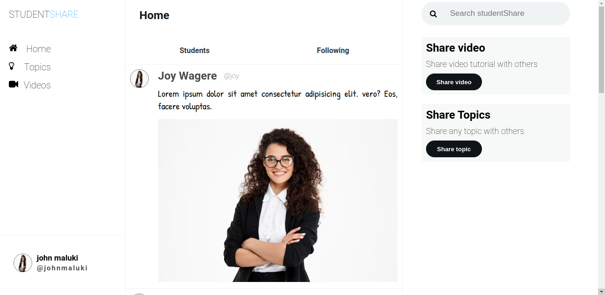
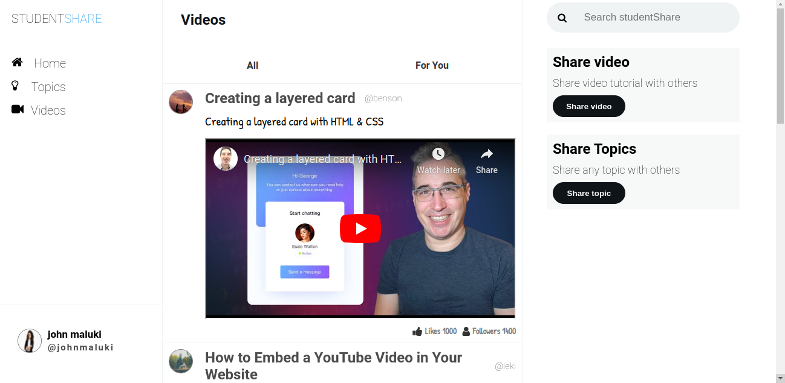
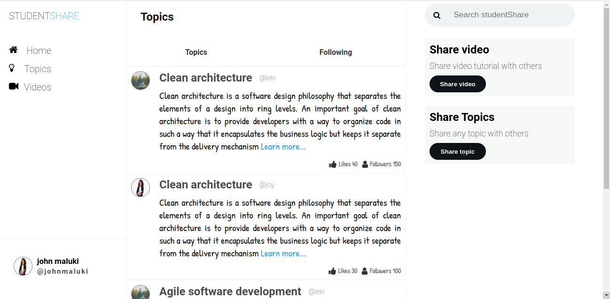

# Student Share

Using the platform, `Student Share`, students can create shareable learning materials such as technical topics and tutorial videos. For the benefit of other students and to help them find high-quality resources, each student can rate the quality of each piece of course material. The materials with the highest likes are displayed first.

## Learning Goals

- Design and architect features across a frontend
- Communicate and collaborate in a technical environment
- Integrate JavaScript and an external API
- Debug issues in small- to medium-sized projects
- Build and iterate on a project MVP

## Project Requirements

- Your app must be a HTML/CSS/JS frontend that accesses data from a public API. All interactions between the client and the API should be handled asynchronously and use JSON as the communication format. (Alternatively use an Array)

- Your entire app must run on a single page. There should be NO redirects. In other words, your project will contain a single HTML file.

- Your app needs to incorporate at least 3 separate event listeners (DOMContentLoaded, click, change, submit, etc).

- Some interactivity is required. This could be as simple as adding a "like" button or adding comments. These interactions do not need to persist after reloading the page.

- Follow good coding practices. Keep your code DRY (Do not repeat yourself) by utilizing functions to abstract repetitive code.

## Technologies Used

The following have been used on this project:

- HTML
- CSS
- JavaScript

#### Live link to view the project <a href="https://john-maluki.github.io/student_share/">View Student Share</a>

## Setup Requirements

- Git
- Web-browser or your choice
- Github

## Screenshots Of the application

- Home section

  

- Videos section

  

- Topics section

  

## Authors

- [John Maluki](https://github.com/john-maluki)

## Copyright

Released under the MIT License. See the [LICENSE](https://github.com/john-maluki/student_share/blob/main/License) file.
